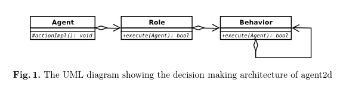
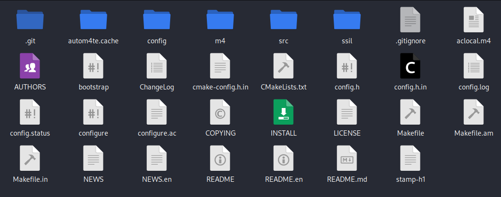

# HELIOS Base Overview

helios-base is a sample team for the RoboCup Soccer 2D Simulator. 

- [Helios Base organization in GitHub](https://github.com/helios-base)
- [Helios Base codebase](https://github.com/helios-base/helios-base)

## HELIOS Base paper's abstract:

To promote the research of multiagent systems, several base codes have been released for the RoboCup soccer 2D simulation community. As described herein, we present HELIOS base, currently the most popular base codes for 2D soccer simulation. HELIOS base involves a common library, a sample team, a visual debugger, and a formation editor, which help us to develop a simulated soccer team.

## Key content from the paper

Each player can intercept, dribble, pass and shoot by judging from the field situations. Although the team strategies remain simple, the team performance is better than any other sample teams. We assume that this sample team is used as a template when starting team development.

The decision making process of agent2d comprises three layers: agent class, role class and behavior class. Any decision making originates from the agent class. The agent class decides the current strategy and the player’s role in the team. The role class is responsible for determining strategic behavior. The role class first gets the current situation and then executes tactical behavior according to the current strategy. Finally, the behavior class performs the actual action.

Developers of a team never need to implement their own agent class, but
might need to implement their own role classes or behavior classes. The de-
fault implementation provides several role instances, but in agent2d there is no
difference among them. If developers would like to step into more detailed devel-
opment such as improving or adding new role classes or behavior classes, then
they require some knowledge and experience of C++ because agent2d is written
entirely in C++.

## Project structure after compiling

## References

The paper about HELIOS Base:
- Hidehisa Akiyama, Tomoharu Nakashima, HELIOS Base: An Open Source
Package for the RoboCup Soccer 2D Simulation, In Sven Behnke, Manuela
Veloso, Arnoud Visser, and Rong Xiong editors, RoboCup2013: Robot
World XVII, Lecture Notes in Artificial Intelligence, Springer Verlag,
Berlin, 2014. http://dx.doi.org/10.1007/978-3-662-44468-9_46
